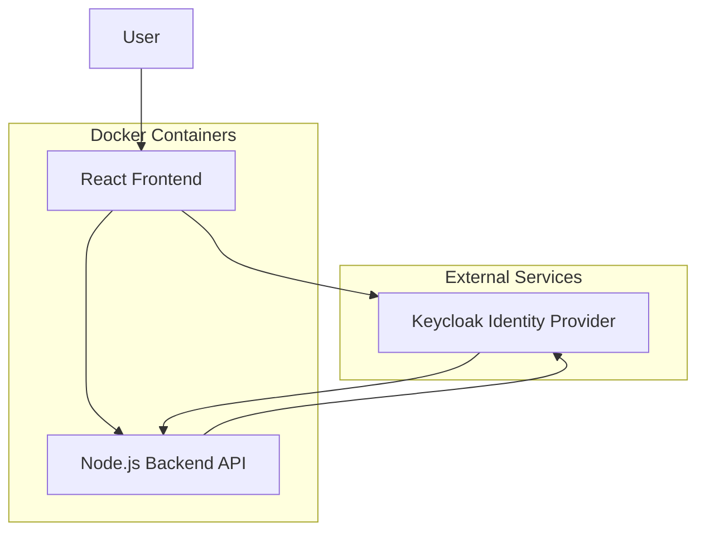
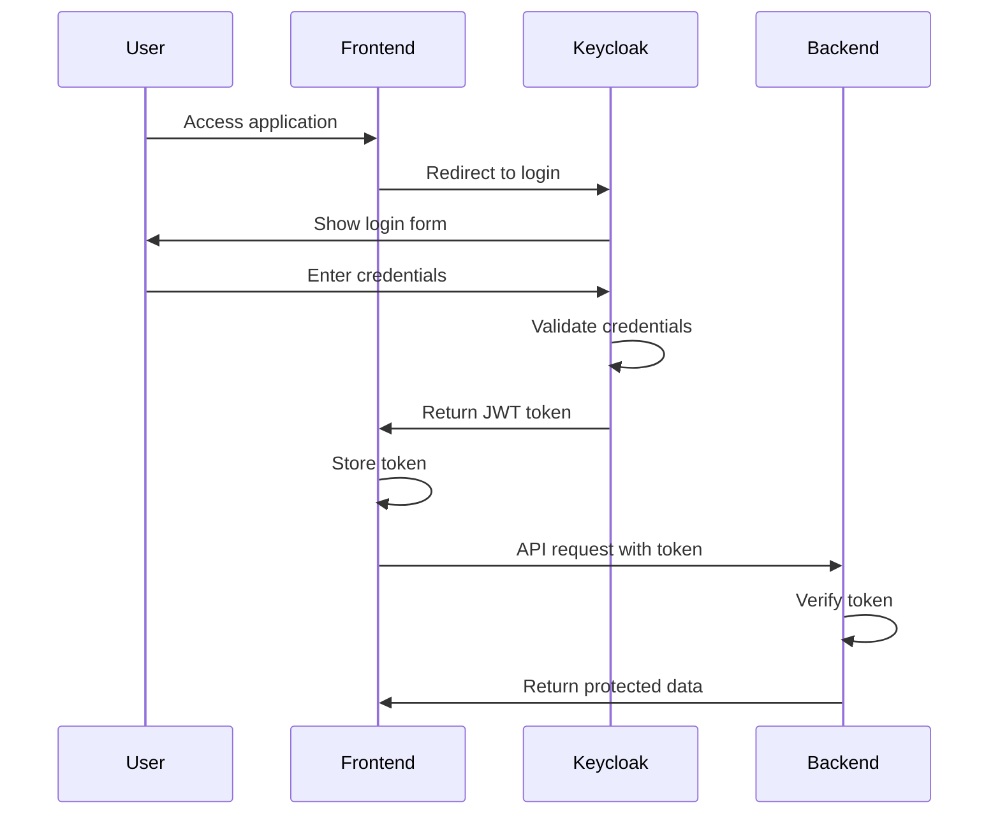
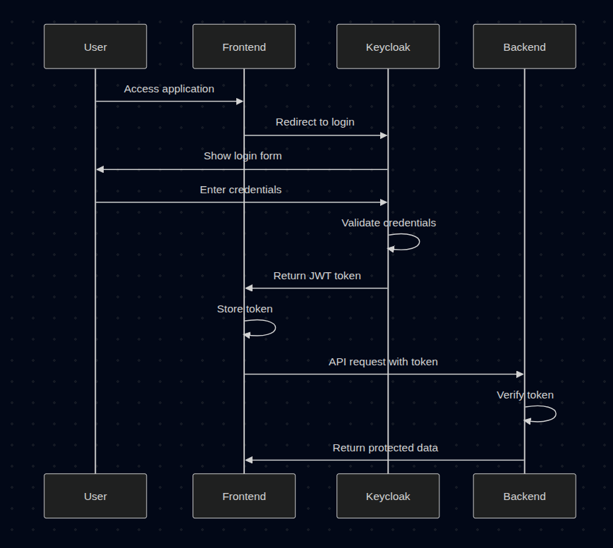
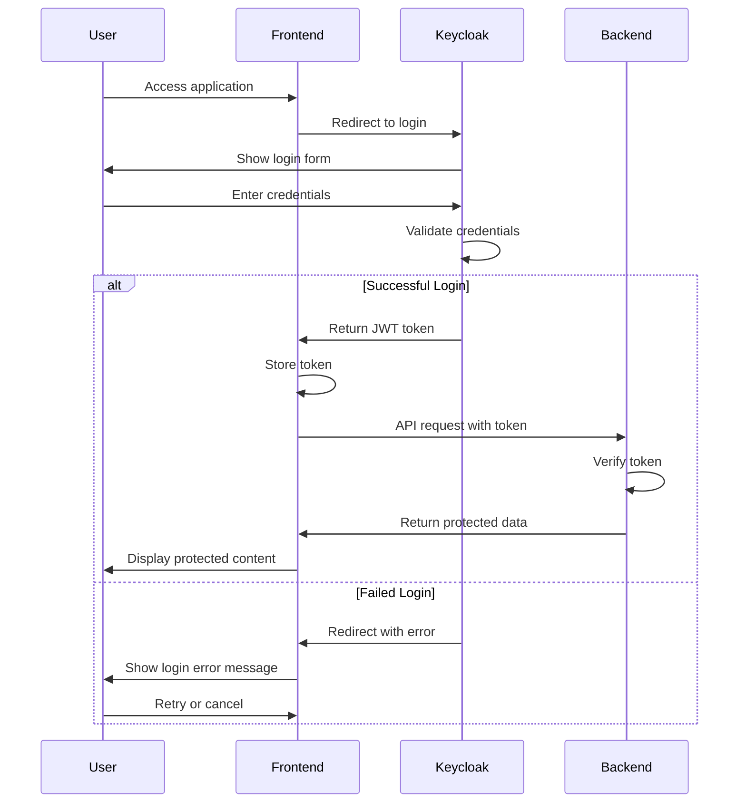
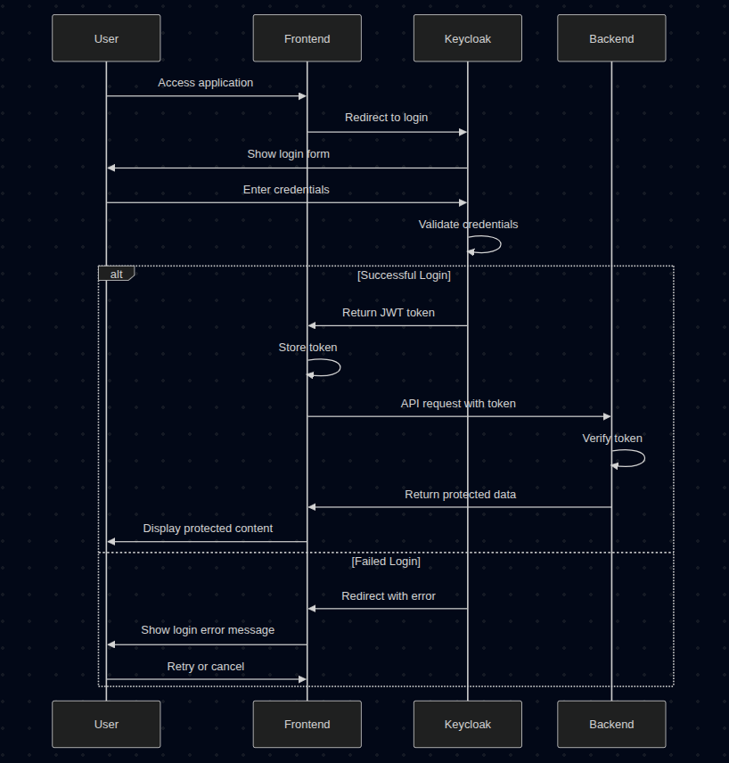
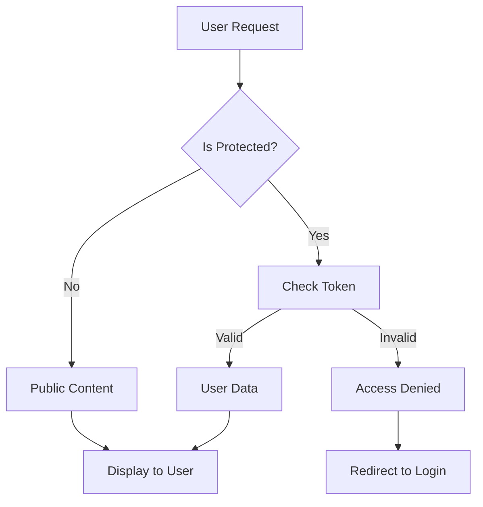
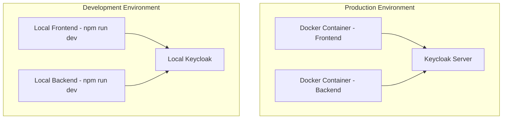

# Keycloak System Architecture Design

## Overview

This document provides a high-level overview of our Keycloak-based authentication system. The system enables secure user authentication and authorization for our web application, allowing users to log in once and access protected resources across our backend services.

## High-Level Architecture

### Key Components

1. **User**: The end-user accessing our application
2. **React Frontend**: The user interface built with React and Vite
3. **Keycloak Identity Provider**: Manages user authentication and issues security tokens
4. **Node.js Backend API**: Our server-side application that provides data and services

## Component Details

### React Frontend

- **Purpose**: Provides the user interface and handles user interactions
- **Technology**: React.js with Vite build tool
- **Key Features**:
  - Public pages (accessible without login)
  - Protected pages (require authentication)
  - Automatic login redirects
  - Token management

### Keycloak Identity Provider

- **Purpose**: Central authentication and authorization server
- **Key Features**:
  - User login/logout
  - Token issuance (JWT)
  - User management
  - Security policies
- **Access**: Admin console at http://localhost:8080

### Node.js Backend API

- **Purpose**: Provides business logic and data access
- **Technology**: Node.js with Express.js framework
- **Key Features**:
  - RESTful API endpoints
  - Token validation
  - Protected data access
  - User-specific content filtering

## Authentication Flow

## Authentication Scenarios

### Successful Login Process

1. User accesses the application
2. Frontend redirects to Keycloak login
3. User enters valid credentials
4. Keycloak validates and issues JWT token
5. Frontend stores token and accesses protected resources
6. Backend verifies token and returns data

### Failed Login Process

1. User accesses the application
2. Frontend redirects to Keycloak login
3. User enters invalid credentials
4. Keycloak rejects login and redirects with error
5. Frontend displays error message to user
6. User can retry login or cancel

## Data Flow

## Security Features

- **Single Sign-On (SSO)**: Login once, access multiple services
- **JWT Tokens**: Secure, stateless authentication
- **Token Expiration**: Automatic token refresh and expiration
- **CORS Protection**: Cross-origin request security
- **Role-Based Access**: Different permissions based on user roles

## Deployment Architecture

### Environments

- **Development**: Local setup with hot-reload for development
- **Production**: Containerized deployment using Docker
- **Keycloak**: Can run locally or as a separate service

## API Endpoints

| Endpoint     | Method | Protection   | Purpose                 |
| ------------ | ------ | ------------ | ----------------------- |
| `/`          | GET    | None         | Welcome message         |
| `/hello`     | GET    | None         | Test endpoint           |
| `/data`      | GET    | JWT Required | Protected user data     |
| `/documents` | GET    | JWT Required | User-specific documents |

## Benefits

- **Security**: Centralized authentication with industry standards
- **User Experience**: Seamless login experience
- **Scalability**: Stateless backend design
- **Maintainability**: Clear separation of concerns
- **Flexibility**: Easy to add new services and features

## Next Steps

- Implement user registration flow
- Add role-based access control
- Integrate with external user directories
- Add multi-factor authentication
- Implement token refresh mechanisms

This architecture provides a solid foundation for secure, scalable authentication in our application.</content>
<parameter name="filePath">/home/rajesh/Documents/Coding/KEYCLOAK_PROJECT/system-architecture.md
